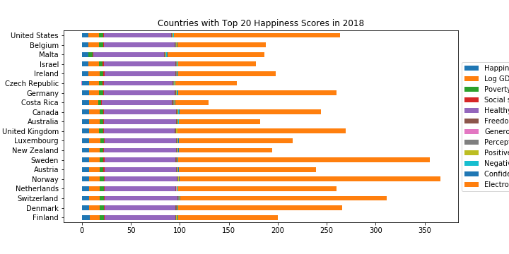

# Happiness Analysis

What is happiness? It feels like the primary goal for a human, yet many struggle to find it in our everyday lives. While many people attempt to work hard for it, countless are sucked into the endless grind for more money, eventually leaving them working solely for the money and forgetting what they were originally searching for. As the old adage goes, money can’t buy happiness. But does this classic saying really hold true? We at [Super Professional Company] have put together a crack team of data analytics experts to find out once and for all.

Questions to answer:
1.	Does freedom or money correlate better with happiness?
2.	Is the Consumer Electronics Revenue per capita related to a country’s happiness?
3.	For countries whose happiness data changes the most (or least) , what factors influence those changes?
4.	How closely are different variables related to happiness correlated to each other?

Data sets to be used:
1.	World Happiness Report 2019
2.	World Bank API
3.	Consumer Electronics Revenue Data from statista.com

Rough Breakdown of Tasks:
1.	Retrieve raw data from data sets
2.	Merge/format/clean data
3.	Do statistical analysis on the data
4.	Visualize in charts
5.	Answer the questions we posed

## Visualization Result

